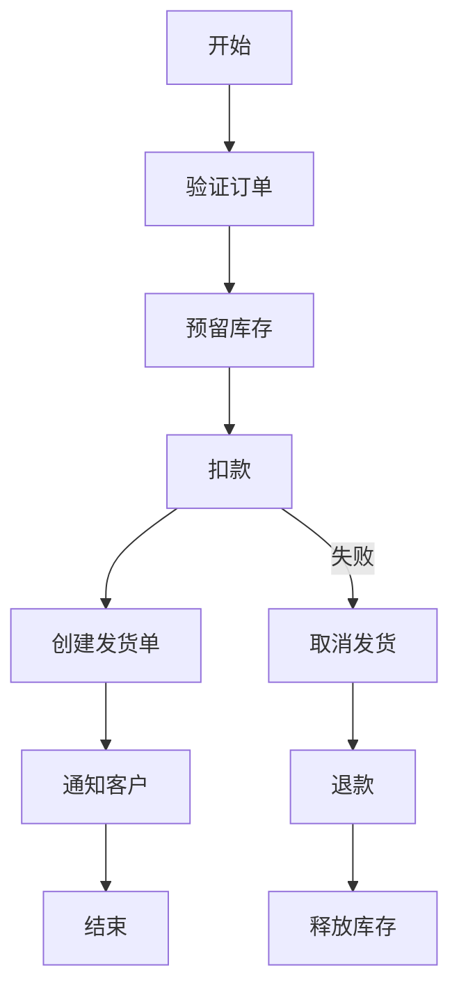
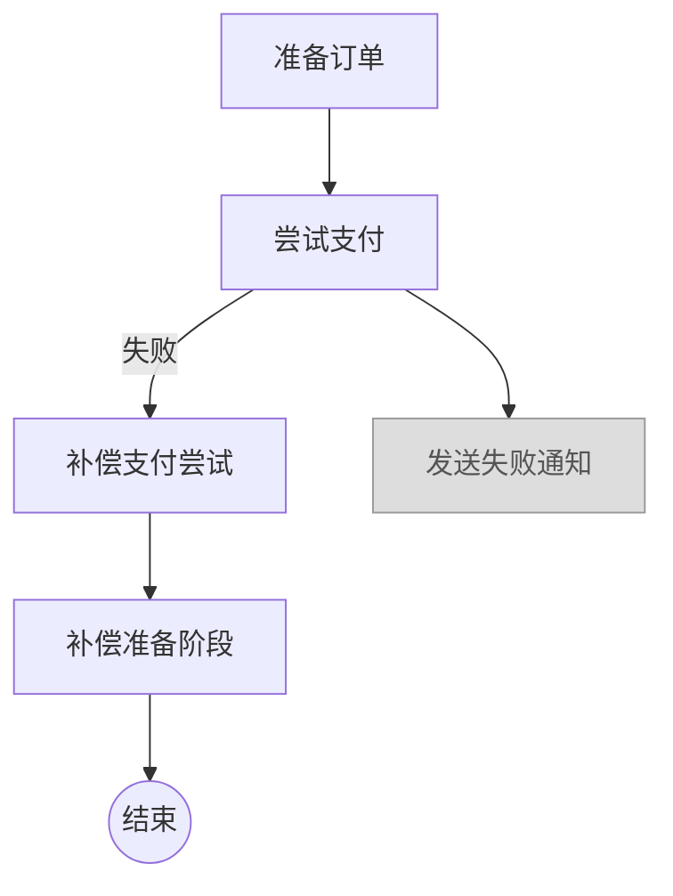
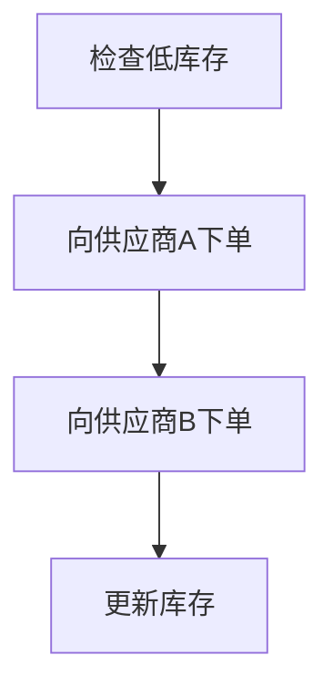

# Aster E-commerce Workflows

> 更新日期：2025-11-10 13:49 NZST · 执行者：Codex

本文档说明 Phase 2.3/2.4 交付的三条 Workflow DSL（订单履约、支付补偿、库存补货）的执行模型、补偿策略与运行时技术细节。

## Workflow 执行模型概览

- **串行调度 + Saga 补偿**：Aster Workflow DSL 将步骤按声明顺序执行，任何步骤返回 `err` 会触发 LIFO 补偿栈。
- **补偿块（`compensate`）**：与上一个 `step` 配对，自动注册在补偿栈中并在失败时反向执行。
- **超时**：每个 workflow 都在 DSL 中显性配置 `timeout`，Runtime 超时后会将 workflow 标记为 `FAILED` 并触发补偿。
- **Hybrid Compilation**：Phase 2.4 中，`npm run emit:class` 通过 TypeScript emitter + `javac` 组合，把 `.aster` 翻译为 `io.aster.ecommerce.*` 可执行类，`PostgresWorkflowRuntime` 直接加载这些类。

## 订单履约 Workflow（order-fulfillment.aster）

**模块/函数**：`io.aster.ecommerce.order_fulfillment.fulfillOrder`  
**超时**：300 秒  
**说明**：覆盖从验证、库存、支付到物流、通知的全链路 Saga。

### 步骤详情

| 步骤 | 作用 | 补偿 |
| --- | --- | --- |
| `validate_order` | 校验订单结构、幂等键、客户画像 | 无 |
| `reserve_inventory` | 扣减库存并返回 `reservationId` | `release_inventory` |
| `charge_payment` | 扣款并返回 `paymentId` | `refund_payment` |
| `create_shipment` | 创建发货指令 | `cancel_shipment` |
| `notify_customer` | 通知客户（邮件/短信） | 无 |

当任何步骤返回 `err`，上表中的补偿步骤会按 LIFO 触发，保证库存、支付与物流资源被回收。

## 支付补偿 Workflow（payment-compensation.aster）

**模块/函数**：`io.aster.ecommerce.payment_compensation.processFailedPayment`  
**超时**：180 秒  
**场景**：模拟支付失败后的回滚路径，演示 Saga 补偿顺序。

- `attempt_payment` 强制返回 `err "insufficient funds"`，触发补偿段。
- 补偿顺序：`attempt_payment.compensate` → `prepare_order.compensate`，最后 workflow 状态变为 `COMPENSATED`。
- `send_failure_notification` 因为错误提前发生而不会执行，DSL 中仍保留以示语义。

## 库存补货 Workflow（inventory-replenishment.aster）

**模块/函数**：`io.aster.ecommerce.inventory_replenishment.replenishInventory`  
**超时**：600 秒  
**说明**：串行补货流程，后续将升级为并发。

- 目前 `supplier_a → supplier_b` 严格串行，保障顺序一致性。
- Phase 2.5 计划：利用即将到来的 `depends on` 语法并行两个供应商步骤，并在 `update_inventory` 前使用 `await` 汇总。

## 技术细节

### 事件存储

- Runtime 使用 `PostgresEventStore` 将 `WorkflowEvent` 与 `WorkflowStateEntity` 落盘。
- `WorkflowAuditResource` 直接查询 `eventStore.getEvents(workflowId, fromSeq)` 并序列化为 `WorkflowEventDTO`，支持 cursor-based 查询。
- `WorkflowStateEntity` 提供 `findByStatus`、`countByStatus`，用于监控和运营。

### 状态机转换

状态集合来源于 `WorkflowState.Status` 与实体计数方法：`READY → RUNNING → {COMPLETED | FAILED | COMPENSATING | COMPENSATED | COMPENSATION_FAILED}`。  
当补偿执行中再次失败，会进入 `COMPENSATION_FAILED` 并暴露在 `/api/workflows/metrics`。

### 重试与超时

- DSL `timeout` 字句在运行时转换成 `Duration`，`PostgresWorkflowRuntime` 会在 `resultFutures` 上注册 TTL，后台任务 `cleanupExpiredFutures()` 每小时清理超时 future。
- 客户端若收到 `OrderResponse.status=ERROR`，可调整 payload 后重新提交；如果仅是网络重试，幂等 workflowId 会阻止重复执行。

### Hybrid Compilation Strategy

1. `npm run emit:class quarkus-policy-api/.../*.aster`
2. `scripts/emit-classfiles.ts` 检测 workflow module → 通过 TypeScript emitter 生成 Java → `javac` 编译到 `build/jvm-classes`
3. `./gradlew :quarkus-policy-api:compileJava` / `generateAsterJar` 将 workflow classes 打包

至此，`OrderResource` 可以在 REST API 调度真正的 workflow，而不再依赖手写 stub。

## 参考

- REST API 详情：`docs/API.md`
- 快速体验：`docs/QUICKSTART.md`
