# Aster 语言架构文档

> 更新时间：2025-10-09
> 文档范围：编译器架构、LSP架构、数据流与核心模块

---

## 概览

Aster 是一种静态类型、面向对象的编程语言，编译到 JVM 字节码。系统架构分为三个主要部分：

1. **编译管道**（Compiler Pipeline）：源码 → 字节码
2. **LSP 服务器**（Language Server Protocol）：IDE 支持
3. **运行时**（Runtime）：JVM 执行环境

---

## 编译管道架构

### 管道阶段

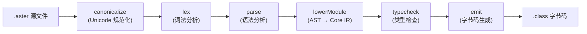

### 阶段详解

| 阶段 | 模块 | 输入 | 输出 | 职责 |
|------|------|------|------|------|
| **Canonicalize** | `src/canonicalizer.ts` | 原始文本 | 规范化文本 | Unicode NFC 规范化，统一换行符 |
| **Lex** | `src/lexer.ts` | 规范化文本 | Token 数组 | 词法分析，生成 Token 流 |
| **Parse** | `src/parser.ts` | Token 数组 | AST | 语法分析，构建抽象语法树 |
| **Lower** | `src/lower_to_core.ts` | AST | Core IR | 降低到核心中间表示，简化后续分析 |
| **Typecheck** | `src/typecheck.ts` | Core IR | 类型标注的 Core IR | 类型推导与检查，effect 验证 |
| **Emit** | `src/emit.ts` | 类型标注的 Core IR | JVM 字节码 | 代码生成，输出 .class 文件 |

### 数据结构演进

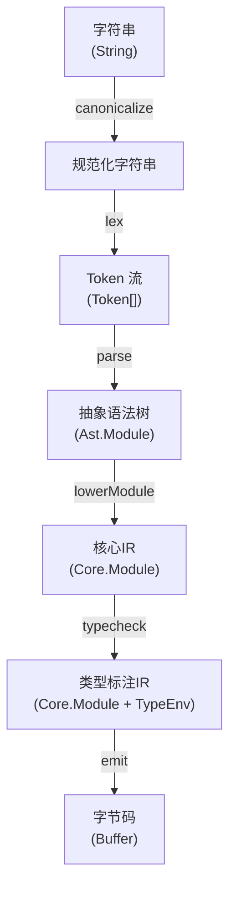

### CST（Concrete Syntax Tree）模式

对于格式化和保留注释的场景，使用 **无损 CST** 模式：

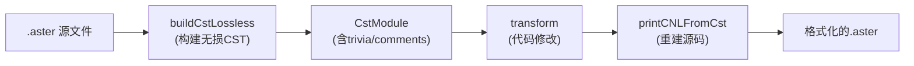

**CST 特性**：
- 保留所有空白（leading/trailing trivia）
- 保留所有注释（inlineComments）
- 保留原始文本（fullText）
- 支持完美重建（lossless round-trip）

---

## 注释保留机制

### 设计目标

Aster 语言支持完整的注释保留，确保格式化和重构工具不会丢失用户的注释。注释保留机制的核心设计目标：

1. **无损保留**：格式化后注释内容和位置完整保留
2. **类型区分**：区分 inline 注释（代码行末尾）和 standalone 注释（独立行）
3. **透明处理**：Parser 自动跳过注释，不影响语法分析
4. **灵活输出**：格式化器可选择保留或移除注释

### 注释 Token 结构

注释在词法分析阶段被识别为特殊的 Token，带有 `channel='trivia'` 标记：

```typescript
type Token = {
  kind: TokenKind.COMMENT;
  value: {
    raw: string;           // 原始文本（含前缀 // 或 #）
    text: string;          // 去除前缀的注释文本
    trivia: 'inline' | 'standalone';  // 注释类型分类
  };
  start: Position;         // 起始位置（行号、列号）
  end: Position;           // 结束位置
  channel: 'trivia';       // 标记为 trivia channel
};
```

**分类规则**：
- **inline**：注释前同一行有非空白代码
- **standalone**：注释前同一行只有空白或缩进

### 处理流程

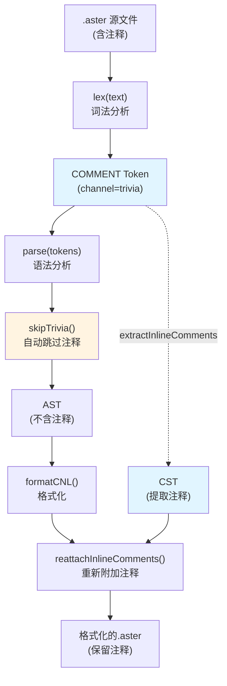

### 关键实现

#### 1. 词法器（Lexer）

**文件**: `src/lexer.ts` (lines 99-112)

词法器在扫描时检测注释并生成 COMMENT Token：

```typescript
// 识别 # 或 // 注释
const emitCommentToken = (prefixLength: number) => {
  const startPos = { line, col };
  let raw = '';
  // 读取完整注释行
  for (let j = 0; j < prefixLength; j++) {
    raw += next();
  }
  while (i < input.length && !isLineBreak(peek())) {
    raw += next();
  }

  const body = raw.slice(prefixLength).replace(/^\s*/, '');
  const prev = findPrevSignificantToken();
  const trivia = prev && prev.end.line === startPos.line ? 'inline' : 'standalone';

  push(TokenKind.COMMENT, { raw, text: body, trivia }, startPos, 'trivia');
};
```

**关键点**：
- 支持 `#` 和 `//` 两种注释前缀
- 通过 `findPrevSignificantToken()` 判断注释类型
- 设置 `channel='trivia'` 标记为非语义 Token

#### 2. Parser（语法分析器）

**文件**: `src/parser.ts` (lines 43-92)

Parser 自动跳过 trivia channel 的 Token：

```typescript
// 跳过所有 trivia Token
skipTrivia: (): void => {
  while (ctx.index < ctx.tokens.length) {
    const tok = ctx.tokens[ctx.index]!;
    if (tok.channel === 'trivia') {
      ctx.index++;
    } else {
      break;
    }
  }
},

// peek() 和 next() 自动调用 skipTrivia()
peek: (offset: number = 0): Token => {
  return ctx.peekToken(offset);  // 内部自动跳过 trivia
},

next: (): Token => {
  const tok = ctx.peek();
  // ... 移动索引 ...
  ctx.skipTrivia();  // 消费后跳过后续 trivia
  return tok;
}
```

**关键点**：
- Parser 完全不感知注释的存在
- AST 构建过程不包含注释节点
- 保持语法分析逻辑的简洁性

#### 3. CST 构建器

**文件**: `src/cst_builder.ts` (lines 18-47)

CST 构建时从 Token 流中提取注释：

```typescript
// 从 Token 流提取注释
function extractInlineComments(tokens: readonly Token[]): InlineComment[] {
  const out: InlineComment[] = [];
  for (const t of tokens) {
    if (t.channel === 'trivia' && t.kind === 'COMMENT') {
      const commentValue = t.value as { raw: string; text: string; trivia: 'inline' | 'standalone' };
      out.push({
        line: t.start.line,
        text: commentValue.raw,         // 保留原始文本（含前缀）
        standalone: commentValue.trivia === 'standalone',
      });
    }
  }
  return out;
}

export function buildCst(text: string, prelexed?: readonly Token[]): CstModule {
  const toks = prelexed ?? lex(text);
  const cstTokens = tokensToCstTokens(text, toks);
  const inlineComments = extractInlineComments(toks);  // 提取注释
  // ... 构建 CST ...
  return { ..., inlineComments };
}
```

**关键点**：
- `tokensToCstTokens` 跳过 trivia Token（line 19-21）
- `extractInlineComments` 专门提取注释 Token
- CST 同时包含 tokens（不含注释）和 inlineComments（注释列表）

#### 4. 格式化器（Formatter）

**文件**: `src/formatter.ts` (lines 43-75)

格式化时重新附加注释到输出：

```typescript
export function formatCNL(text: string, opts?: {
  preserveComments?: boolean;
  preserveStandaloneComments?: boolean;
}): string {
  const can = canonicalize(input);
  let tokens = lex(can);
  let originalTokens;  // 用于提取注释

  // 当保留注释时，词法化原始文本以提取注释 Token
  if (opts?.preserveComments) {
    try {
      originalTokens = lex(text);  // 注意：使用原始文本而非 canonicalized 文本
    } catch {
      originalTokens = undefined;
    }
  }

  // 使用 originalTokens 构建 CST 以获取注释
  const cst = buildCst(text, originalTokens ?? tokens);
  const ast = parse(tokens);  // Parser 使用 canonicalized tokens
  let formatted = simpleFormatModule(ast);

  // 重新附加注释
  if (opts?.preserveComments) {
    formatted = reattachInlineComments(text, formatted, cst.inlineComments,
                                       !!opts?.preserveStandaloneComments);
  }

  return formatted;
}
```

**关键点**：
- 必须对原始文本（未经 canonicalize）词法化以保留注释
- Parser 使用 canonicalized tokens 确保语法正确性
- CST 使用 originalTokens 提取注释信息
- `reattachInlineComments` 将注释附加到格式化输出

### 注释重附加策略

**文件**: `src/formatter.ts` (lines 75-120)

```typescript
function reattachInlineComments(
  original: string,
  formatted: string,
  inline?: readonly InlineComment[],
  includeStandalone?: boolean
): string {
  const fmtLines = formatted.split(/\r?\n/);

  // 1. 提取 inline 注释
  const comments = inline?.filter(c => !c.standalone).map(c => c.text) ?? [];

  // 2. 逐行附加 inline 注释到非空行
  let ci = 0;
  for (let i = 0; i < fmtLines.length && ci < comments.length; i++) {
    const line = fmtLines[i]!;
    if (line.trim().length === 0) continue;
    if (/\/\//.test(line) || /(^|\s)#/.test(line)) continue;  // 避免重复
    fmtLines[i] = line.replace(/[ \t]+$/, '') + '  ' + comments[ci]!;
    ci++;
  }

  // 3. 插入 standalone 注释（可选）
  if (includeStandalone) {
    const standalone = inline?.filter(c => c.standalone).map(c => c.text) ?? [];
    let si = 0;

    // 第一个 standalone 插入到顶部
    const firstNonEmpty = fmtLines.findIndex(l => l.trim().length > 0);
    if (firstNonEmpty >= 0 && si < standalone.length) {
      fmtLines.splice(firstNonEmpty, 0, standalone[si]!);
      si++;
    }

    // 中间的 standalone 插入到缩进行之后
    const firstIndented = fmtLines.findIndex(l => /^\s+\S/.test(l));
    while (si < standalone.length - 1 && firstIndented >= 0) {
      fmtLines.splice(firstIndented + 1, 0, standalone[si]!);
      si++;
    }

    // 最后一个 standalone 插入到末尾
    if (si < standalone.length) {
      fmtLines.push(standalone[si]!);
    }
  }

  return fmtLines.join('\n');
}
```

**重附加策略**：
1. **Inline 注释**：按顺序附加到格式化后的非空行末尾
2. **Standalone 注释**：
   - 第一个：插入到文件顶部（模块头之前）
   - 中间的：插入到第一个缩进行之后（函数体内）
   - 最后一个：插入到文件末尾

### 示例

#### 输入（含注释）

```typescript
This module is demo.comments.

# Standalone comment at top
To greet with name: Text, produce Text: // inline comment after header
  Let x be Text.concat("Hi, ", name).  // say hi
  Return x.
# Standalone comment at bottom
```

#### 处理流程

1. **词法分析**：生成 3 个 COMMENT Token（2 个 standalone，1 个 inline）
2. **语法分析**：跳过 COMMENT Token，构建 AST（不含注释）
3. **CST 构建**：提取 3 个 InlineComment 对象
4. **格式化**：重新排版代码
5. **重附加注释**：
   - Inline 注释附加到 `To greet...` 行
   - Standalone 注释插入到顶部和底部

#### 输出（保留注释）

```typescript
# Standalone comment at top
This module is demo.comments.

To greet with name: Text, produce Text:  // inline comment after header
  Let x be Text.concat("Hi, ", name).
  Return x.
# Standalone comment at bottom
```

### 相关文件

- **词法器**: `src/lexer.ts` - 注释 Token 生成
- **Parser**: `src/parser.ts` - 自动跳过 trivia
- **CST 构建器**: `src/cst_builder.ts` - 提取注释
- **格式化器**: `src/formatter.ts` - 重附加注释
- **类型定义**: `src/types.ts` - Token 和 InlineComment 类型
- **测试**: `test/property.test.ts` (lines 104-211) - 注释 Token 属性测试
- **黄金测试**: `test/comments/golden/` - 注释保留端到端测试
- **测试脚本**: `scripts/test-comments-golden.ts` - 黄金测试执行器

### 设计决策

#### 为什么使用 trivia channel？

**优点**：
- Parser 逻辑简洁，完全不感知注释
- 注释不污染 AST 结构
- 符合编译器设计最佳实践（参考 Roslyn、TypeScript）

**权衡**：
- 需要单独的注释提取逻辑
- 重附加策略可能不完美（best-effort）

#### 为什么区分 inline 和 standalone？

**原因**：
- Inline 注释通常是代码解释，应保持在对应行
- Standalone 注释通常是章节分隔或大段说明，位置更灵活
- 不同类型的注释需要不同的重附加策略

#### 为什么格式化器对原始文本词法化？

**原因**：
- `canonicalize()` 会规范化文本，可能影响注释识别
- 必须从原始文本中提取注释以保证完整性
- Parser 仍使用 canonicalized tokens 确保语法正确

---

## 异步纪律检查

### 设计目标

Aster 语言的异步编程模型要求严格的任务管理纪律，确保所有异步任务正确启动和等待，避免悬挂任务、重复启动等常见错误。异步纪律检查的核心设计目标：

1. **完整性保证**：确保每个 `Start` 的任务都被 `Wait`，每个 `Wait` 的任务都已 `Start`
2. **错误检测**：在编译期检测重复启动、重复等待等错误模式
3. **清晰诊断**：提供详细的错误信息，包含任务名称、出现次数和建议修复方式
4. **控制流分析**：基于控制流图（CFG）分析所有可能执行路径

### 检查规则

| 错误类型 | 代码 | 严重级别 | 描述 | 示例 |
|---------|------|---------|------|------|
| **Start 未 Wait** | `ASYNC_START_NOT_WAITED` | `error` | 启动的异步任务未被等待，可能导致悬挂任务 | `Start profile as async fetchProfile(id).` 但函数结束前未 `Wait for profile` |
| **Wait 未 Start** | `ASYNC_WAIT_NOT_STARTED` | `error` | 等待的任务从未启动，导致死锁 | `Wait for profile.` 但从未 `Start profile` |
| **重复 Start** | `ASYNC_DUPLICATE_START` | `error` | 同一任务被启动多次，导致资源泄漏 | `Start profile ...` 出现 2 次或以上 |
| **重复 Wait** | `ASYNC_DUPLICATE_WAIT` | `warning` | 同一任务被等待多次，虽然安全但通常是逻辑错误 | `Wait for profile.` 出现 2 次或以上 |

**检查触发条件**：
- 函数包含至少一个 `Start` 或 `Wait` 语句
- 在类型检查阶段的 `collectAsync` 函数中执行

### 检查流程

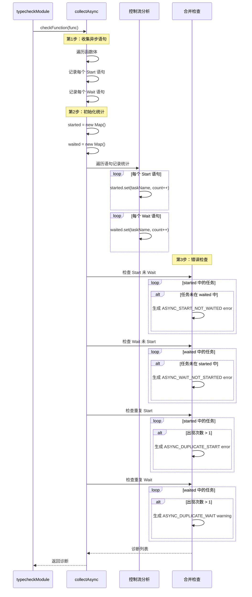

### 关键实现

#### 1. collectAsync 函数结构

**文件**: `src/typecheck.ts` (lines 1489-1606)

`collectAsync` 函数负责收集异步语句并进行纪律检查：

```typescript
function collectAsync(
  body: Core.Block,
  env: TypeEnv,
  diags: Diagnostic[]
): Core.AsyncInfo {
  const starts: Core.AsyncStart[] = [];
  const waits: Core.WaitExpr[] = [];

  // 第1步：收集所有 Start 和 Wait 语句
  const visit = (s: Core.Stmt): void => {
    switch (s.kind) {
      case 'Start':
        starts.push(s);
        break;
      case 'Wait':
        waits.push(s);
        break;
      case 'If':
        s.thenBlock.statements.forEach(visit);
        s.elseBlock?.statements.forEach(visit);
        break;
      case 'Match':
        s.cases.forEach(c => c.body.statements.forEach(visit));
        break;
      case 'Block':
        s.statements.forEach(visit);
        break;
    }
  };
  body.statements.forEach(visit);

  // 第2步：统计每个任务的启动和等待次数
  const started = new Map<string, number>();
  const waited = new Map<string, number>();

  for (const st of starts) {
    started.set(st.name, (started.get(st.name) ?? 0) + 1);
  }

  for (const wt of waits) {
    for (const name of wt.names) {
      waited.set(name, (waited.get(name) ?? 0) + 1);
    }
  }

  // 第3步：错误检查
  checkAsyncDiscipline(started, waited, starts, waits, diags);

  return { starts, waits };
}
```

**关键点**：
- 使用递归 `visit` 函数遍历所有控制流分支（If/Match/Block）
- 使用 `Map<string, number>` 统计每个任务名的出现次数
- 错误检查函数 `checkAsyncDiscipline` 集中处理所有 4 种错误类型

#### 2. 错误检查逻辑

**文件**: `src/typecheck.ts` (lines 1550-1606)

```typescript
function checkAsyncDiscipline(
  started: Map<string, number>,
  waited: Map<string, number>,
  starts: Core.AsyncStart[],
  waits: Core.WaitExpr[],
  diags: Diagnostic[]
): void {
  // 检查1：Start 未 Wait
  for (const [name, _count] of started) {
    if (!waited.has(name)) {
      const st = starts.find(s => s.name === name);
      diags.push({
        severity: 'error',
        code: 'ASYNC_START_NOT_WAITED',
        message: `Async task "${name}" was started but not waited`,
        span: st?.span,
      });
    }
  }

  // 检查2：Wait 未 Start
  for (const [name, _count] of waited) {
    if (!started.has(name)) {
      const wt = waits.find(w => w.names.includes(name));
      diags.push({
        severity: 'error',
        code: 'ASYNC_WAIT_NOT_STARTED',
        message: `Async task "${name}" was never started`,
        span: wt?.span,
      });
    }
  }

  // 检查3：重复 Start（error）
  for (const [name, count] of started) {
    if (count > 1) {
      diags.push({
        severity: 'error',
        code: 'ASYNC_DUPLICATE_START',
        message: `Async task "${name}" was started multiple times (${count} times)`,
      });
    }
  }

  // 检查4：重复 Wait（warning）
  for (const [name, count] of waited) {
    if (count > 1) {
      diags.push({
        severity: 'warning',
        code: 'ASYNC_DUPLICATE_WAIT',
        message: `Async task "${name}" was waited multiple times (${count} times)`,
      });
    }
  }
}
```

**关键点**：
- 使用 `Map.has()` 检查任务是否存在于另一组
- 使用 `count > 1` 检测重复操作
- 错误附带任务名称和出现次数，便于调试
- `span` 字段指向错误发生的源码位置

#### 3. 控制流分支处理

**支持的控制流结构**：

```typescript
// If 语句：检查两个分支
case 'If':
  s.thenBlock.statements.forEach(visit);
  s.elseBlock?.statements.forEach(visit);
  break;

// Match 表达式：检查所有 case 分支
case 'Match':
  s.cases.forEach(c => c.body.statements.forEach(visit));
  break;

// Block：递归检查嵌套块
case 'Block':
  s.statements.forEach(visit);
  break;
```

**局限性**：
- 当前实现采用保守策略（union semantics）：任何分支的 Start/Wait 都计入统计
- 不区分分支执行的互斥性（例如 `if/else` 只执行一个分支）
- 未来改进方向：引入路径敏感分析（path-sensitive analysis）

### 示例

#### 正常场景：单个 Start-Wait 对

```typescript
To fetchData with u: User, produce Text. It performs io:
  Start profile as async fetchProfile(u.id).
  Wait for profile.
  Return "Done".
```

**检查结果**：
- `started = { profile: 1 }`
- `waited = { profile: 1 }`
- ✅ 无错误

#### 错误场景1：Start 未 Wait

```typescript
To fetchData with u: User, produce Text. It performs io:
  Start profile as async fetchProfile(u.id).
  Return "Done".  // 忘记 Wait
```

**诊断输出**：
```
error[ASYNC_START_NOT_WAITED]: Async task "profile" was started but not waited
  --> src/demo.aster:3:3
   |
 3 |   Start profile as async fetchProfile(u.id).
   |   ^^^^^^^^^^^^^^^^^^^^^^^^^^^^^^^^^^^^^^^^^ task started here
```

#### 错误场景2：Wait 未 Start

```typescript
To fetchData with u: User, produce Text. It performs io:
  Wait for profile.  // 从未 Start
  Return "Done".
```

**诊断输出**：
```
error[ASYNC_WAIT_NOT_STARTED]: Async task "profile" was never started
  --> src/demo.aster:2:3
   |
 2 |   Wait for profile.
   |   ^^^^^^^^^^^^^^^^^ waiting for never-started task
```

#### 错误场景3：重复 Start

```typescript
To fetchData with u: User, produce Text. It performs io:
  Start profile as async fetchProfile(u.id).
  Start profile as async fetchProfile(u.id).  // 重复启动
  Wait for profile.
  Return "Done".
```

**诊断输出**：
```
error[ASYNC_DUPLICATE_START]: Async task "profile" was started multiple times (2 times)
  --> src/demo.aster:2:3
```

#### 错误场景4：重复 Wait（警告）

```typescript
To fetchData with u: User, produce Text. It performs io:
  Start profile as async fetchProfile(u.id).
  Wait for profile.
  Wait for profile.  // 重复等待
  Return "Done".
```

**诊断输出**：
```
warning[ASYNC_DUPLICATE_WAIT]: Async task "profile" was waited multiple times (2 times)
  --> src/demo.aster:3:3
```

#### 混合错误场景

```typescript
To fetchData with u: User, produce Text. It performs io:
  Start profile as async fetchProfile(u.id).
  Start profile as async fetchProfile(u.id).  // 错误1：重复 Start
  Start timeline as async fetchTimeline(u.id).  // 错误2：未 Wait
  Wait for profile.
  Wait for profile.  // 错误3：重复 Wait
  Wait for settings.  // 错误4：未 Start
  Return "Done".
```

**诊断输出**（4 个错误）：
```
error[ASYNC_START_NOT_WAITED]: Async task "timeline" was started but not waited
error[ASYNC_WAIT_NOT_STARTED]: Async task "settings" was never started
error[ASYNC_DUPLICATE_START]: Async task "profile" was started multiple times (2 times)
warning[ASYNC_DUPLICATE_WAIT]: Async task "profile" was waited multiple times (2 times)
```

### 相关文件

- **类型检查器**: `src/typecheck.ts` (lines 1489-1606) - `collectAsync` 函数与错误检查逻辑
- **类型定义**: `src/types.ts` - `AsyncInfo`、`AsyncStart`、`WaitExpr` 类型定义
- **测试文件**: `test/async-discipline.test.ts` - 12 个测试用例覆盖所有错误类型
- **示例代码**: `test/cnl/examples/` - 异步编程示例（未包含负例）

### 设计决策

#### 为什么采用保守策略（union semantics）？

**原因**：
- 简化实现，避免复杂的路径分析
- 保守策略安全：宁可误报（false positive）也不漏报（false negative）
- 适用于大多数实际场景（开发者通常不会在分支中启动同名任务）

**权衡**：
- 可能产生误报，例如：
  ```typescript
  If condition,:
    Start task1 as async foo().
  Otherwise,:
    Start task2 as async bar().
  Wait for task1 or task2.  // 当前实现会报错 task1 和 task2 都未等待
  ```
- 未来可引入路径敏感分析改进

#### 为什么重复 Wait 是 warning 而非 error？

**原因**：
- 重复等待语义上安全（第二次 Wait 立即返回已完成的结果）
- 可能是合理的编程模式（例如在不同分支中等待）
- 但通常是逻辑错误（复制粘贴错误），值得警告

**权衡**：
- 如果未来支持"等待新结果"语义，需要升级为 error

#### 为什么在编译期检查而非运行时检查？

**原因**：
- 编译期检查成本为零，无运行时开销
- 及早发现错误，避免生产环境问题
- 提供更清晰的错误信息（源码位置、任务名称）

**权衡**：
- 需要静态分析所有控制流路径
- 无法检测运行时动态生成的任务名

### 限制与未来改进

#### 当前限制

1. **不支持路径敏感分析**：
   - 无法识别互斥分支（if/else）
   - 无法识别必然执行路径

2. **不支持循环内异步任务**：
   - `For Each` 循环中的 Start/Wait 未正确分析
   - 当前实现会计数所有迭代的累加

3. **不支持动态任务名**：
   - 任务名必须是字面量字符串
   - 无法检查运行时构造的任务名

4. **缺少跨函数分析**：
   - 仅检查单个函数内的异步纪律
   - 无法检测调用链中的任务传递

#### 未来改进方向

1. **路径敏感分析**：
   - 引入控制流图（CFG）+ 数据流分析
   - 区分必然执行路径和可能执行路径
   - 参考 Rust 的借用检查器（borrow checker）

2. **循环分析**：
   - 检测循环不变量（loop invariants）
   - 检测循环终止后的任务完整性

3. **过程间分析**（Inter-procedural Analysis）：
   - 跨函数传递异步任务状态
   - 检测任务泄漏到调用者

4. **增强诊断信息**：
   - 显示任务的启动和等待位置
   - 提供修复建议（Quick Fix）
   - 集成到 LSP Code Action

---

## LSP 服务器架构

### 服务器启动流程

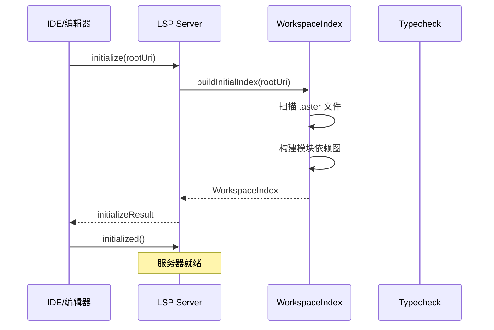

### 文档变更流程

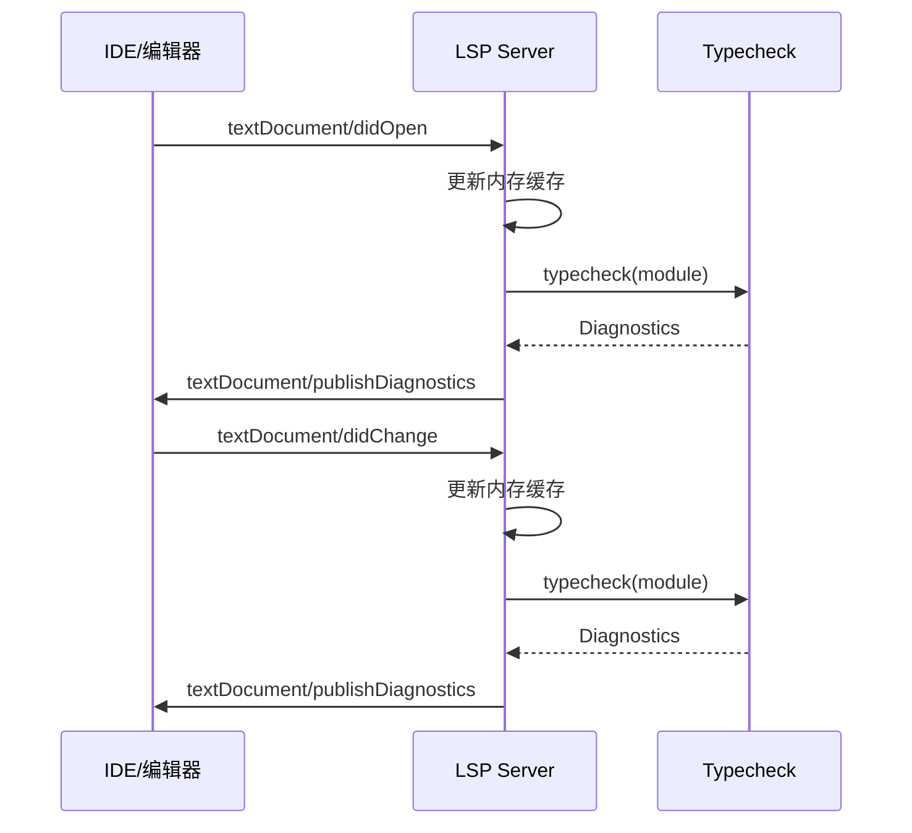

### Hover 请求流程

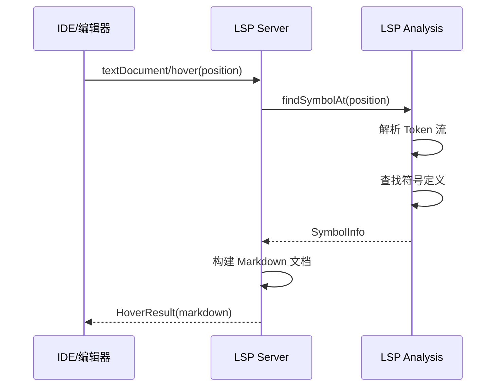

### Code Action 流程

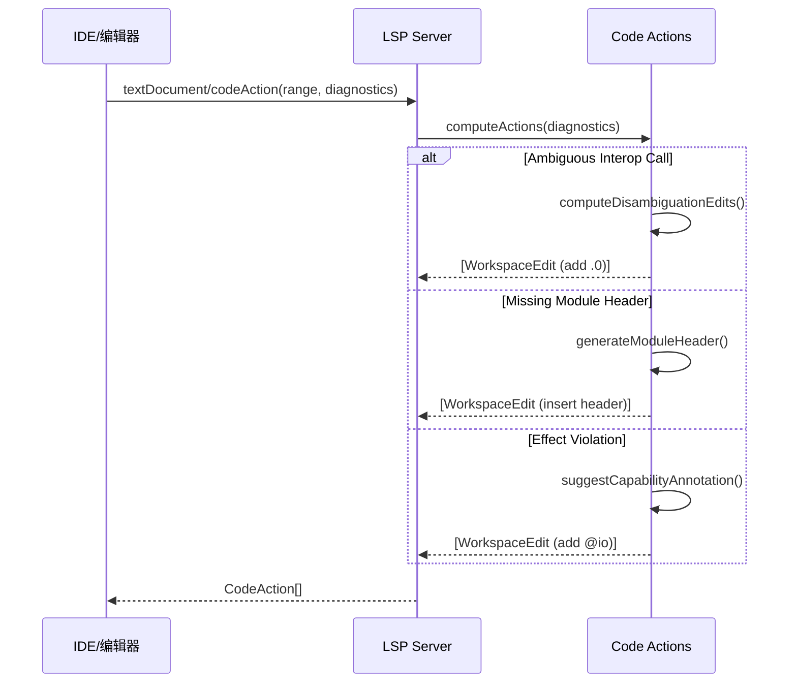

### LSP 模块组织

```
src/lsp/
├── server.ts              # LSP 主服务器（协议处理）
├── workspace_index.ts     # 工作空间索引（文件监控）
├── analysis.ts            # 代码分析工具
│   ├── findSymbolAt()     # 符号查找
│   ├── findReferences()   # 引用查找
│   └── findDottedCallAt() # Interop 调用分析
└── capabilities.ts        # LSP 能力声明
```

---

## 类型系统架构

### 类型推导流程

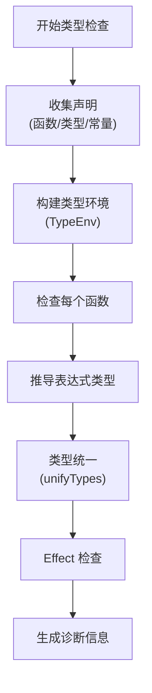

### Effect 系统

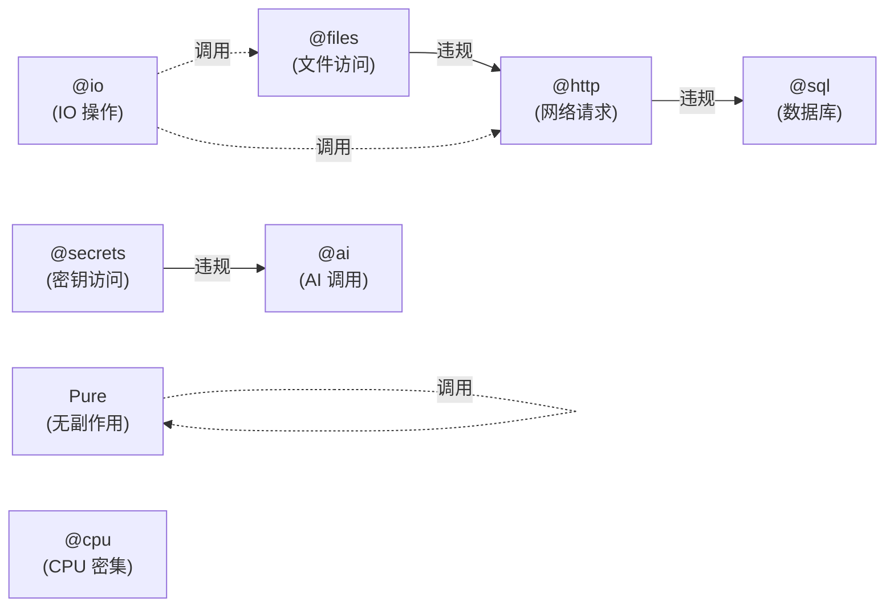

**Effect 检查规则**：
1. Pure 函数不能调用有副作用的函数
2. 具有细粒度 effect（如 `@files`）的函数不能调用更广泛的 effect（如 `@http`）
3. Effect 传递性：调用者必须声明被调用函数的所有 effect
4. 可通过环境变量 `ASTER_CAP_EFFECTS_ENFORCE=1` 开启严格检查

---

## 关键模块详解

### 1. Canonicalizer（规范化器）

**文件**: `src/canonicalizer.ts`

**职责**：
- Unicode NFC 规范化（统一字符编码）
- 换行符统一（CRLF → LF）
- BOM 处理

**特性**：
- **幂等性**：多次规范化结果相同
- **性能**：使用 String.normalize('NFC')，Small 项目 ~0.03ms

### 2. Lexer（词法分析器）

**文件**: `src/lexer.ts`

**职责**：
- 将文本切分为 Token 流
- 识别关键字、标识符、字面量、运算符
- 处理缩进（Python 风格）

**Token 类型**：
- 关键字：`To`, `Define`, `Return`, `Let`, `Match`, `For Each`, `Start`, `Wait`
- 标识符：`IDENT` (小写开头), `TYPE_IDENT` (大写开头)
- 字面量：`INT`, `STRING`, `BOOL`
- 运算符：`=`, `+`, `-`, `*`, `/`, `and`, `or`, `not`
- 结构：`INDENT`, `DEDENT`, `NEWLINE`, `EOF`

**性能**：Small 项目 ~0.03ms

### 3. Parser（语法分析器）

**文件**: `src/parser.ts`

**职责**：
- 将 Token 流解析为 AST
- 语法错误检测
- 泛型解析（`To identity of T`）

**AST 节点类型**：
```typescript
// 模块级
type Module = { kind: 'Module'; decls: Decl[] }

// 声明
type Decl = FuncDecl | DataDecl | SumDecl

// 表达式
type Expr = LiteralExpr | VarExpr | CallExpr | IfExpr | MatchExpr | ForExpr

// 语句
type Stmt = LetStmt | ReturnStmt | StartStmt | WaitStmt | ExprStmt
```

**性能**：Small 项目 ~0.12ms

### 4. Lower（IR 降低器）

**文件**: `src/lower_to_core.ts`

**职责**：
- AST → Core IR 转换
- 语法糖脱糖（desugaring）
- 简化表达式结构

**Core IR 特性**：
- 统一的表达式表示
- 明确的类型标注位置
- 消除语法糖（如 `Match` 表达式展开）

**性能**：Small 项目 ~0.06ms

### 5. Typecheck（类型检查器）

**文件**: `src/typecheck.ts`

**职责**：
- 类型推导（Hindley-Milner 风格）
- 类型统一（unifyTypes）
- Effect 验证
- 泛型约束检查

**类型环境（TypeEnv）**：
```typescript
class TypeEnv {
  vars: Map<string, Core.Type>
  funcs: Map<string, FuncSignature>
  types: Map<string, DataType | SumType>

  lookup(name: string): Core.Type
  bind(name: string, type: Core.Type): void
}
```

**诊断信息**：
```typescript
type Diagnostic = {
  severity: 'error' | 'warning'
  message: string
  span?: Span
}
```

**性能**：Small 项目完整管道 ~0.28ms

### 6. Emit（代码生成器）

**文件**: `src/emit.ts`

**职责**：
- Core IR → JVM 字节码
- 类型映射（Aster → JVM）
- 字节码优化

**类型映射**：
- `Int` → `I` (int)
- `Text` → `Ljava/lang/String;`
- `Bool` → `Z` (boolean)
- Record → Java class
- Sum → Java sealed interface + records

---

## 配置与环境

### 环境变量

| 变量 | 默认值 | 说明 |
|------|-------|------|
| `ASTER_CAP_EFFECTS_ENFORCE` | 未设置 | 启用严格 effect 检查（设为 `1`） |
| `ASTER_DEBUG_TYPES` | 未设置 | 输出类型推导调试信息（设为 `1`） |
| `ASTER_EFFECT_CONFIG` | 未设置 | 自定义 effect 配置文件路径 |
| `LOG_LEVEL` | `INFO` | 日志级别（`DEBUG`/`INFO`/`WARN`/`ERROR`） |
| `NODE_ENV` | 未设置 | 运行环境（`production`/`development`） |

### Effect 配置文件

路径：`.aster/effects.json` 或 `ASTER_EFFECT_CONFIG` 指定

```json
{
  "prefixes": {
    "FileSvc": "@files",
    "HttpClient": "@http",
    "DbPool": "@sql"
  },
  "hierarchy": {
    "@io": ["@files", "@http", "@sql"],
    "@files": [],
    "@http": [],
    "@sql": []
  }
}
```

---

## 性能特征

### 编译性能（基于 perf-report.json）

| 规模 | 文件数 | 代码行数 | parse p50 | 完整管道 p50 |
|------|--------|---------|-----------|-------------|
| **Small** | 1 | ~10 | 0.12 ms | 0.28 ms |
| **Medium** | 40 | ~3200 | 6.5 ms | 21 ms |
| **Large** | 1 | ~350 | 0.48 ms | 1.4 ms |

### LSP 性能

| 操作 | Small p95 | Medium p95 | 说明 |
|------|----------|-----------|------|
| **Hover** | 5000 ms | 5000 ms | 已知性能问题（超时）|
| **Completion** | 2.1 ms | 2.2 ms | 自动补全响应 |
| **Diagnostics** | 0 ms | 0 ms | 缓存优化 |

详见 `docs/performance.md`。

---

## 测试架构

### 测试类型

1. **Golden 测试**（`test/golden.ts`）
   - 验证编译输出一致性
   - 117 个测试用例
   - 包含 AST/Core IR/诊断输出对比

2. **属性测试**（`test/property.test.ts`）
   - Canonicalizer 幂等性
   - Lexer 总是生成 EOF
   - Parser 错误恢复

3. **Fuzz 测试**（`test/lossless.fuzz.test.ts`）
   - CST 无损重建
   - 4000 个随机trivia注入测试

4. **LSP 测试**
   - `scripts/lsp-*.smoke.js` - 烟雾测试
   - `test/lsp.props.test.ts` - 属性测试

### 测试覆盖

```bash
npm run test          # 所有测试
npm run test:golden   # Golden 测试
npm run test:property # 属性测试
npm run test:lossless # 无损CST测试
npm run test:lsp      # LSP属性测试
```

---

## 依赖与工具链

### 核心依赖

| 包 | 版本 | 用途 |
|---|------|------|
| `typescript` | ^5.x | 编译器实现语言 |
| `vscode-languageserver` | ^9.x | LSP 协议实现 |
| `fast-check` | ^3.x | 属性测试 |
| `audit-ci` | ^7.x | 依赖安全扫描 |

### 构建工具

- **tsc**: TypeScript 编译器
- **build-peg.js**: PEG 解析器生成（headers）
- **esbuild**: 未使用（可考虑加速构建）

---

## 扩展点

### 1. 新增语言特性

1. 更新 `src/lexer.ts` 添加新 Token
2. 更新 `src/parser.ts` 添加语法规则
3. 更新 `src/lower_to_core.ts` 降低到 Core IR
4. 更新 `src/typecheck.ts` 类型检查逻辑
5. 更新 `src/emit.ts` 字节码生成
6. 添加 Golden 测试用例

### 2. 新增 Effect 类型

1. 更新 `.aster/effects.json` 配置
2. 更新 `src/config/effects.ts` 常量定义
3. 添加测试用例到 `test/cnl/examples/eff_*.aster`

### 3. 新增 LSP 功能

1. 更新 `src/lsp/capabilities.ts` 声明能力
2. 在 `src/lsp/server.ts` 注册处理器
3. 实现分析逻辑到 `src/lsp/analysis.ts`
4. 添加烟雾测试到 `scripts/lsp-*.smoke.js`

---

## 已知限制与未来改进

### 当前限制

1. **LSP Hover 性能问题**：所有请求超时（5秒），需架构重构
2. **单线程类型检查**：大型项目性能瓶颈
3. **缺少增量编译**：每次全量重新编译
4. **有限的字节码优化**：未实现常量折叠等优化

### Roadmap（参考 `.claude/enterprise-improvement-roadmap.md`）

- **Stage 3.1**: LSP 架构重构（模块化，Worker线程）
- **Stage 3.2**: 性能基准系统 ✅（已完成）
- **Stage 3.3**: 代码质量改进 ✅（已完成）
- **Stage 4**: 增量编译与缓存
- **Stage 5**: 高级类型特性（联合类型、交叉类型）

---

## 参考资料

- **源码仓库**: `/Users/rpang/IdeaProjects/aster-lang`
- **运维文档**: `docs/operations/`
- **性能报告**: `docs/performance.md`
- **测试文档**: `docs/testing.md`

## 贡献指南

1. 遵循 `.claude/CLAUDE.md` 开发准则
2. 所有代码必须通过 `npm run ci` 完整测试
3. 新特性必须包含 Golden 测试用例
4. 遵循现有命名约定（小驼峰，类型大驼峰）
5. 使用结构化日志（`src/utils/logger.ts`）

---

**维护者**: Aster 开发团队
**最后更新**: 2025-10-09
