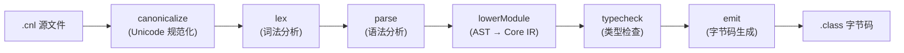
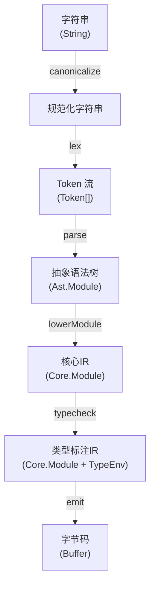
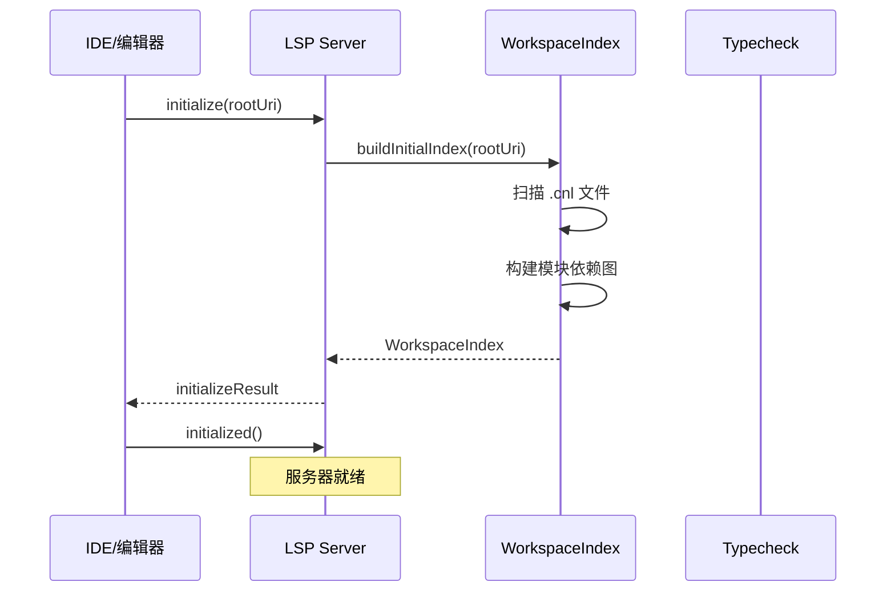
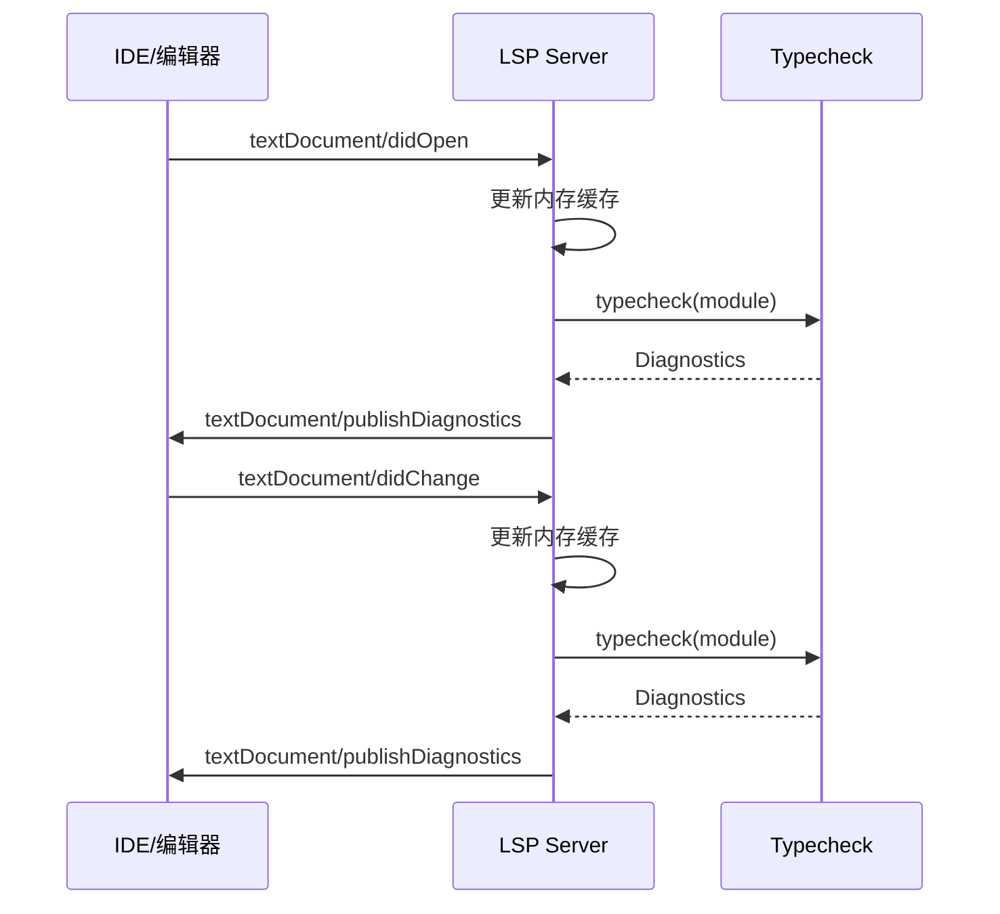
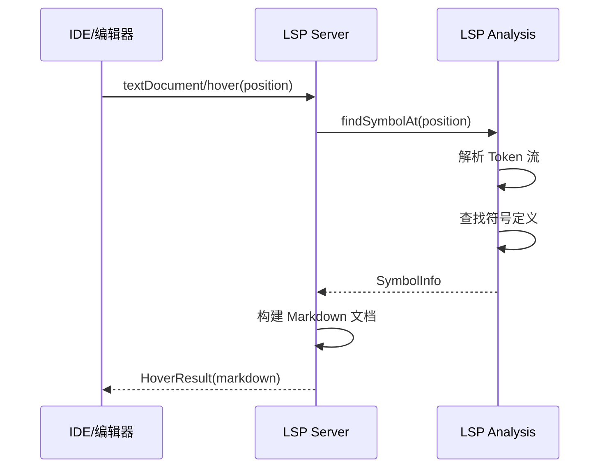
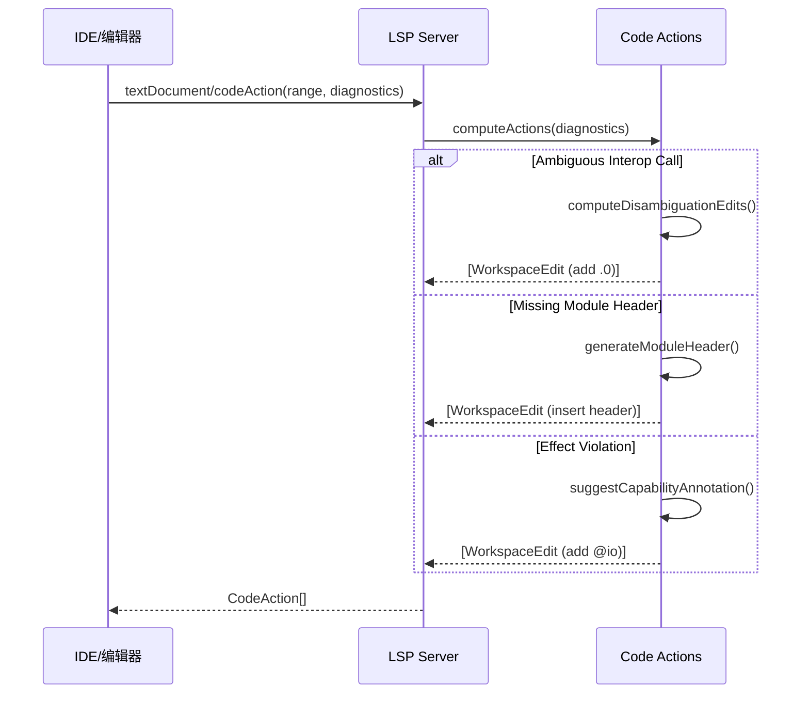
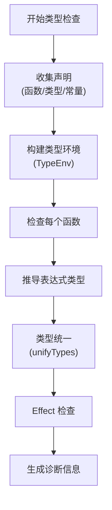
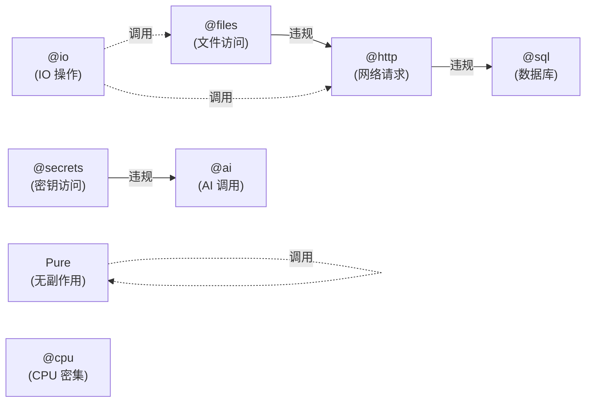

# Aster 语言架构文档

> 更新时间：2025-10-09
> 文档范围：编译器架构、LSP架构、数据流与核心模块

---

## 概览

Aster 是一种静态类型、面向对象的编程语言，编译到 JVM 字节码。系统架构分为三个主要部分：

1. **编译管道**（Compiler Pipeline）：源码 → 字节码
2. **LSP 服务器**（Language Server Protocol）：IDE 支持
3. **运行时**（Runtime）：JVM 执行环境

---

## 编译管道架构

### 管道阶段



### 阶段详解

| 阶段 | 模块 | 输入 | 输出 | 职责 |
|------|------|------|------|------|
| **Canonicalize** | `src/canonicalizer.ts` | 原始文本 | 规范化文本 | Unicode NFC 规范化，统一换行符 |
| **Lex** | `src/lexer.ts` | 规范化文本 | Token 数组 | 词法分析，生成 Token 流 |
| **Parse** | `src/parser.ts` | Token 数组 | AST | 语法分析，构建抽象语法树 |
| **Lower** | `src/lower_to_core.ts` | AST | Core IR | 降低到核心中间表示，简化后续分析 |
| **Typecheck** | `src/typecheck.ts` | Core IR | 类型标注的 Core IR | 类型推导与检查，effect 验证 |
| **Emit** | `src/emit.ts` | 类型标注的 Core IR | JVM 字节码 | 代码生成，输出 .class 文件 |

### 数据结构演进



### CST（Concrete Syntax Tree）模式

对于格式化和保留注释的场景，使用 **无损 CST** 模式：


**CST 特性**：
- 保留所有空白（leading/trailing trivia）
- 保留所有注释（inlineComments）
- 保留原始文本（fullText）
- 支持完美重建（lossless round-trip）

---

## LSP 服务器架构

### 服务器启动流程



### 文档变更流程



### Hover 请求流程



### Code Action 流程



### LSP 模块组织

```
src/lsp/
├── server.ts              # LSP 主服务器（协议处理）
├── workspace_index.ts     # 工作空间索引（文件监控）
├── analysis.ts            # 代码分析工具
│   ├── findSymbolAt()     # 符号查找
│   ├── findReferences()   # 引用查找
│   └── findDottedCallAt() # Interop 调用分析
└── capabilities.ts        # LSP 能力声明
```

---

## 类型系统架构

### 类型推导流程



### Effect 系统



**Effect 检查规则**：
1. Pure 函数不能调用有副作用的函数
2. 具有细粒度 effect（如 `@files`）的函数不能调用更广泛的 effect（如 `@http`）
3. Effect 传递性：调用者必须声明被调用函数的所有 effect
4. 可通过环境变量 `ASTER_CAP_EFFECTS_ENFORCE=1` 开启严格检查

---

## 关键模块详解

### 1. Canonicalizer（规范化器）

**文件**: `src/canonicalizer.ts`

**职责**：
- Unicode NFC 规范化（统一字符编码）
- 换行符统一（CRLF → LF）
- BOM 处理

**特性**：
- **幂等性**：多次规范化结果相同
- **性能**：使用 String.normalize('NFC')，Small 项目 ~0.03ms

### 2. Lexer（词法分析器）

**文件**: `src/lexer.ts`

**职责**：
- 将文本切分为 Token 流
- 识别关键字、标识符、字面量、运算符
- 处理缩进（Python 风格）

**Token 类型**：
- 关键字：`To`, `Define`, `Return`, `Let`, `Match`, `For Each`, `Start`, `Wait`
- 标识符：`IDENT` (小写开头), `TYPE_IDENT` (大写开头)
- 字面量：`INT`, `STRING`, `BOOL`
- 运算符：`=`, `+`, `-`, `*`, `/`, `and`, `or`, `not`
- 结构：`INDENT`, `DEDENT`, `NEWLINE`, `EOF`

**性能**：Small 项目 ~0.03ms

### 3. Parser（语法分析器）

**文件**: `src/parser.ts`

**职责**：
- 将 Token 流解析为 AST
- 语法错误检测
- 泛型解析（`To identity of T`）

**AST 节点类型**：
```typescript
// 模块级
type Module = { kind: 'Module'; decls: Decl[] }

// 声明
type Decl = FuncDecl | DataDecl | SumDecl

// 表达式
type Expr = LiteralExpr | VarExpr | CallExpr | IfExpr | MatchExpr | ForExpr

// 语句
type Stmt = LetStmt | ReturnStmt | StartStmt | WaitStmt | ExprStmt
```

**性能**：Small 项目 ~0.12ms

### 4. Lower（IR 降低器）

**文件**: `src/lower_to_core.ts`

**职责**：
- AST → Core IR 转换
- 语法糖脱糖（desugaring）
- 简化表达式结构

**Core IR 特性**：
- 统一的表达式表示
- 明确的类型标注位置
- 消除语法糖（如 `Match` 表达式展开）

**性能**：Small 项目 ~0.06ms

### 5. Typecheck（类型检查器）

**文件**: `src/typecheck.ts`

**职责**：
- 类型推导（Hindley-Milner 风格）
- 类型统一（unifyTypes）
- Effect 验证
- 泛型约束检查

**类型环境（TypeEnv）**：
```typescript
class TypeEnv {
  vars: Map<string, Core.Type>
  funcs: Map<string, FuncSignature>
  types: Map<string, DataType | SumType>

  lookup(name: string): Core.Type
  bind(name: string, type: Core.Type): void
}
```

**诊断信息**：
```typescript
type Diagnostic = {
  severity: 'error' | 'warning'
  message: string
  span?: Span
}
```

**性能**：Small 项目完整管道 ~0.28ms

### 6. Emit（代码生成器）

**文件**: `src/emit.ts`

**职责**：
- Core IR → JVM 字节码
- 类型映射（Aster → JVM）
- 字节码优化

**类型映射**：
- `Int` → `I` (int)
- `Text` → `Ljava/lang/String;`
- `Bool` → `Z` (boolean)
- Record → Java class
- Sum → Java sealed interface + records

---

## 配置与环境

### 环境变量

| 变量 | 默认值 | 说明 |
|------|-------|------|
| `ASTER_CAP_EFFECTS_ENFORCE` | 未设置 | 启用严格 effect 检查（设为 `1`） |
| `ASTER_DEBUG_TYPES` | 未设置 | 输出类型推导调试信息（设为 `1`） |
| `ASTER_EFFECT_CONFIG` | 未设置 | 自定义 effect 配置文件路径 |
| `LOG_LEVEL` | `INFO` | 日志级别（`DEBUG`/`INFO`/`WARN`/`ERROR`） |
| `NODE_ENV` | 未设置 | 运行环境（`production`/`development`） |

### Effect 配置文件

路径：`.aster/effects.json` 或 `ASTER_EFFECT_CONFIG` 指定

```json
{
  "prefixes": {
    "FileSvc": "@files",
    "HttpClient": "@http",
    "DbPool": "@sql"
  },
  "hierarchy": {
    "@io": ["@files", "@http", "@sql"],
    "@files": [],
    "@http": [],
    "@sql": []
  }
}
```

---

## 性能特征

### 编译性能（基于 perf-report.json）

| 规模 | 文件数 | 代码行数 | parse p50 | 完整管道 p50 |
|------|--------|---------|-----------|-------------|
| **Small** | 1 | ~10 | 0.12 ms | 0.28 ms |
| **Medium** | 40 | ~3200 | 6.5 ms | 21 ms |
| **Large** | 1 | ~350 | 0.48 ms | 1.4 ms |

### LSP 性能

| 操作 | Small p95 | Medium p95 | 说明 |
|------|----------|-----------|------|
| **Hover** | 5000 ms | 5000 ms | 已知性能问题（超时）|
| **Completion** | 2.1 ms | 2.2 ms | 自动补全响应 |
| **Diagnostics** | 0 ms | 0 ms | 缓存优化 |

详见 `docs/performance.md`。

---

## 测试架构

### 测试类型

1. **Golden 测试**（`test/golden.ts`）
   - 验证编译输出一致性
   - 117 个测试用例
   - 包含 AST/Core IR/诊断输出对比

2. **属性测试**（`test/property.test.ts`）
   - Canonicalizer 幂等性
   - Lexer 总是生成 EOF
   - Parser 错误恢复

3. **Fuzz 测试**（`test/lossless.fuzz.test.ts`）
   - CST 无损重建
   - 4000 个随机trivia注入测试

4. **LSP 测试**
   - `scripts/lsp-*.smoke.js` - 烟雾测试
   - `test/lsp.props.test.ts` - 属性测试

### 测试覆盖

```bash
npm run test          # 所有测试
npm run test:golden   # Golden 测试
npm run test:property # 属性测试
npm run test:lossless # 无损CST测试
npm run test:lsp      # LSP属性测试
```

---

## 依赖与工具链

### 核心依赖

| 包 | 版本 | 用途 |
|---|------|------|
| `typescript` | ^5.x | 编译器实现语言 |
| `vscode-languageserver` | ^9.x | LSP 协议实现 |
| `fast-check` | ^3.x | 属性测试 |
| `audit-ci` | ^7.x | 依赖安全扫描 |

### 构建工具

- **tsc**: TypeScript 编译器
- **build-peg.js**: PEG 解析器生成（headers）
- **esbuild**: 未使用（可考虑加速构建）

---

## 扩展点

### 1. 新增语言特性

1. 更新 `src/lexer.ts` 添加新 Token
2. 更新 `src/parser.ts` 添加语法规则
3. 更新 `src/lower_to_core.ts` 降低到 Core IR
4. 更新 `src/typecheck.ts` 类型检查逻辑
5. 更新 `src/emit.ts` 字节码生成
6. 添加 Golden 测试用例

### 2. 新增 Effect 类型

1. 更新 `.aster/effects.json` 配置
2. 更新 `src/config/effects.ts` 常量定义
3. 添加测试用例到 `cnl/examples/eff_*.cnl`

### 3. 新增 LSP 功能

1. 更新 `src/lsp/capabilities.ts` 声明能力
2. 在 `src/lsp/server.ts` 注册处理器
3. 实现分析逻辑到 `src/lsp/analysis.ts`
4. 添加烟雾测试到 `scripts/lsp-*.smoke.js`

---

## 已知限制与未来改进

### 当前限制

1. **LSP Hover 性能问题**：所有请求超时（5秒），需架构重构
2. **单线程类型检查**：大型项目性能瓶颈
3. **缺少增量编译**：每次全量重新编译
4. **有限的字节码优化**：未实现常量折叠等优化

### Roadmap（参考 `.claude/enterprise-improvement-roadmap.md`）

- **Stage 3.1**: LSP 架构重构（模块化，Worker线程）
- **Stage 3.2**: 性能基准系统 ✅（已完成）
- **Stage 3.3**: 代码质量改进 ✅（已完成）
- **Stage 4**: 增量编译与缓存
- **Stage 5**: 高级类型特性（联合类型、交叉类型）

---

## 参考资料

- **源码仓库**: `/Users/rpang/IdeaProjects/aster-lang`
- **运维文档**: `docs/operations/`
- **性能报告**: `docs/performance.md`
- **测试文档**: `docs/testing.md`

## 贡献指南

1. 遵循 `.claude/CLAUDE.md` 开发准则
2. 所有代码必须通过 `npm run ci` 完整测试
3. 新特性必须包含 Golden 测试用例
4. 遵循现有命名约定（小驼峰，类型大驼峰）
5. 使用结构化日志（`src/utils/logger.ts`）

---

**维护者**: Aster 开发团队
**最后更新**: 2025-10-09
